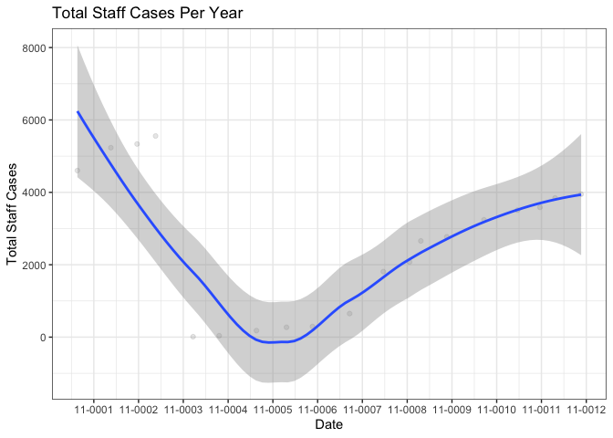
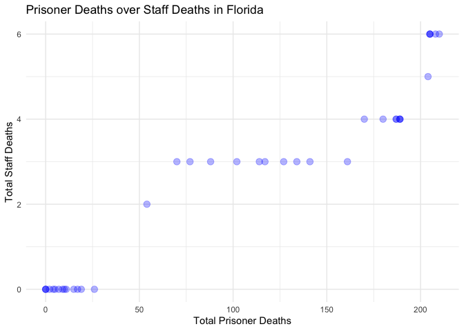
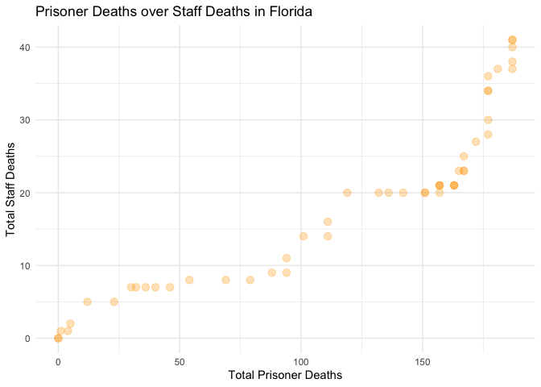

Caliskan\_finalproj
================
Neslihan Caliskan
5/1/2021

### The Data

The data is consisting of the prisoners and stuffs were impacted by
Covid-19 (deaths, case rates) in all the states in the US.

Loading in
    datasets

``` r
library(tidyverse)
```

    ## ── Attaching packages ─────────────────────────────────────── tidyverse 1.3.0 ──

    ## ✓ ggplot2 3.3.3     ✓ purrr   0.3.4
    ## ✓ tibble  3.0.6     ✓ dplyr   1.0.4
    ## ✓ tidyr   1.1.2     ✓ stringr 1.4.0
    ## ✓ readr   1.4.0     ✓ forcats 0.5.1

    ## ── Conflicts ────────────────────────────────────────── tidyverse_conflicts() ──
    ## x dplyr::filter() masks stats::filter()
    ## x dplyr::lag()    masks stats::lag()

``` r
library(readr)
library(ggplot2)
library(here)
```

    ## here() starts at /Users/Nesli/Desktop/Github/hw-ncaliskan/final_project

``` r
library(plotly)
```

    ## 
    ## Attaching package: 'plotly'

    ## The following object is masked from 'package:ggplot2':
    ## 
    ##     last_plot

    ## The following object is masked from 'package:stats':
    ## 
    ##     filter

    ## The following object is masked from 'package:graphics':
    ## 
    ##     layout

``` r
if ( !dir.exists( here::here("final_project", "data") ) ) {
  dir.create( here::here("final_project", "data", "output", ".R"), recursive = TRUE )
}
```

Loading in csv files

``` r
covid_prison_case <- read_csv(here("data", "covid_prison_cases.csv"))
```

    ## 
    ## ── Column specification ────────────────────────────────────────────────────────
    ## cols(
    ##   name = col_character(),
    ##   abbreviation = col_character(),
    ##   staff_tests = col_double(),
    ##   staff_tests_with_multiples = col_double(),
    ##   total_staff_cases = col_double(),
    ##   staff_recovered = col_double(),
    ##   total_staff_deaths = col_double(),
    ##   prisoner_tests = col_double(),
    ##   prisoner_tests_with_multiples = col_double(),
    ##   total_prisoner_cases = col_double(),
    ##   prisoners_recovered = col_double(),
    ##   total_prisoner_deaths = col_double(),
    ##   as_of_date = col_character(),
    ##   notes = col_character()
    ## )

``` r
covid_prison_rate <- read_csv(here("data", "covid_prison_rates.csv"))
```

    ## 
    ## ── Column specification ────────────────────────────────────────────────────────
    ## cols(
    ##   name = col_character(),
    ##   latest_week = col_character(),
    ##   cumulative_prisoner_cases = col_double(),
    ##   prisoner_cases_pct = col_double(),
    ##   prisoner_case_rate = col_character(),
    ##   cumulative_prisoner_deaths = col_double(),
    ##   prisoner_deaths_pct = col_double(),
    ##   prisoner_death_rate = col_character(),
    ##   cumulative_staff_cases = col_double(),
    ##   staff_cases_pct = col_double(),
    ##   staff_case_rate = col_character(),
    ##   cumulative_staff_deaths = col_double(),
    ##   staff_deaths_pct = col_double(),
    ##   staff_death_rate = col_character()
    ## )

``` r
covid_population <-  read_csv(here("data", "prison_populations.csv"))
```

    ## 
    ## ── Column specification ────────────────────────────────────────────────────────
    ## cols(
    ##   name = col_character(),
    ##   abbreviation = col_character(),
    ##   march_pop = col_double(),
    ##   april_pop = col_double(),
    ##   june_pop = col_double(),
    ##   july_pop = col_double(),
    ##   aug_pop = col_double(),
    ##   sept_pop = col_double(),
    ##   oct_pop = col_double(),
    ##   nov_pop = col_double(),
    ##   as_of_date_march = col_character(),
    ##   as_of_date_april = col_character(),
    ##   as_of_date_june = col_character(),
    ##   as_of_date_july = col_character(),
    ##   as_of_date_aug = col_character(),
    ##   as_of_date_sept = col_character(),
    ##   as_of_date_oct = col_character(),
    ##   as_of_date_nov = col_character()
    ## )

``` r
staff_population <-  read_csv(here("data", "staff_populations.csv"))
```

    ## 
    ## ── Column specification ────────────────────────────────────────────────────────
    ## cols(
    ##   name = col_character(),
    ##   abbreviation = col_character(),
    ##   april_pop = col_double(),
    ##   as_of_date = col_character(),
    ##   notes = col_character()
    ## )

Renamed the column so the names for it wouldn’t overlap across different
datasets when I join them together.

``` r
(staff_population %>% 
   rename(staff_april_pop = april_pop))
```

    ## # A tibble: 51 x 5
    ##    name    abbreviation staff_april_pop as_of_date notes                        
    ##    <chr>   <chr>                  <dbl> <chr>      <chr>                        
    ##  1 Alabama AL                      6259 9/30/2019  The staff number is from Sep…
    ##  2 Alaska  AK                        NA <NA>       <NA>                         
    ##  3 Arizona AZ                      8700 5/11/2020  <NA>                         
    ##  4 Arkans… AR                      4045 2/29/2020  <NA>                         
    ##  5 Califo… CA                     46000 4/15/2020  CDCR's pio says that it's ro…
    ##  6 Colora… CO                      6267 12/2/2019  Staff numbers are from a gov…
    ##  7 Connec… CT                      6170 3/1/2020   <NA>                         
    ##  8 Delawa… DE                      2530 5/8/2020   <NA>                         
    ##  9 Florida FL                     22218 4/15/2020  <NA>                         
    ## 10 Georgia GA                      8399 6/30/2019  <NA>                         
    ## # … with 41 more rows

Joining all three datasets
together

``` r
# Merged_Covid_Data <- full_join(staff_population, covid_population, by = c("name", "abbreviation")) %>% 
#   full_join(covid_prison_case, by = c("name", "abbreviation"))
```

Filtering to see all the Florida data

``` r
Florida_Data <- covid_prison_case %>% 
  filter(name == "Florida") %>% 
  select(abbreviation, as_of_date, total_staff_cases, total_staff_deaths, total_prisoner_cases, total_prisoner_deaths)
```

``` r
Staff_Data_FL <- staff_population %>% 
   filter(name == "Florida") %>% 
    select(as_of_date, april_pop)
```

``` r
Prisoner_Data_FL <- covid_population %>% 
   filter(name == "Florida") 
```

``` r
ggplot(Florida_Data,
       aes(x = as.Date(as_of_date), 
           y= total_staff_cases),
           color = "purple",
           fill = "purple") +
  geom_point(alpha = 0.1) +
  scale_x_date("Date", date_breaks = "12 months", date_labels = "%m-%Y") +
  scale_y_discrete(name = "Total Staff Cases") +
  geom_smooth(method = "loess") +
  geom_vline(xintercept = as.numeric(as.Date("2020-01-01")), linetype = "dashed") +
  scale_y_continuous(name = "Total Staff Cases") +
  ggtitle("Total Staff Cases Per Year") +
  theme_bw() 
```

    ## Scale for 'y' is already present. Adding another scale for 'y', which will
    ## replace the existing scale.

    ## `geom_smooth()` using formula 'y ~ x'

    ## Warning: Removed 31 rows containing non-finite values (stat_smooth).

    ## Warning: Removed 31 rows containing missing values (geom_point).

<!-- -->

Compare prisoner cases to staff cases in Florida

``` r
ggplot(Florida_Data,
       aes(x = total_prisoner_cases, 
           y= total_staff_cases)) +
  geom_point(alpha = 0.4,
             size = 6,
             color = "purple",
             fill = "purple") +
  scale_x_continuous(name = "Total Prisoner Cases") +
  scale_y_continuous(name = "Total Staff Cases") +
  ggtitle("Prisoner Cases over Staff Cases in Florida") +
  theme_classic() 
```

<!-- -->

Compare prisoner deaths to staff deaths in Florida

``` r
ggplot(Florida_Data,
       aes(x = total_prisoner_deaths, 
           y= total_staff_deaths)) +
  geom_point(alpha = 0.3,
             size = 3,
             color = "blue",
             fill = "blue") +
  scale_x_continuous(name = "Total Prisoner Deaths") +
  scale_y_continuous(name = "Total Staff Deaths") +
  ggtitle("Prisoner Deaths over Staff Deaths in Florida") +
  theme_minimal() 
```

    ## Warning: Removed 12 rows containing missing values (geom_point).

<!-- -->

Get the summary table for multiple columns in the dataset

``` r
Summarized_Florida_Data <- Florida_Data %>% 
  summarise(TSC_MN = mean(total_staff_cases, na.rm = TRUE),
            TSC_SD = sd(total_staff_cases, na.rm = TRUE),
            TSD_MN = mean(total_staff_deaths, na.rm = TRUE),
            TSD_SD = sd(total_staff_deaths, na.rm = TRUE),
            TPC_MD = mean(total_prisoner_cases, na.rm = TRUE),
            TPC_SD = sd(total_prisoner_cases, na.rm = TRUE),
            TPD_MN = mean(total_prisoner_deaths, na.rm = TRUE),
            TPD_SD = sd(total_prisoner_deaths, na.rm = TRUE),
            TSC_min = min(total_staff_cases, na.rm = TRUE),
            TSD_min = min(total_staff_deaths, na.rm = TRUE),
            TPC_min = min(total_prisoner_cases, na.rm = TRUE),
            TPD_min = min(total_prisoner_deaths, na.rm = TRUE),
            TSC_max = max(total_staff_cases, na.rm = TRUE),
            TSD_max = max(total_staff_deaths, na.rm = TRUE),
            TPC_max = max(total_prisoner_cases, na.rm = TRUE),
            TPD_max = max(total_prisoner_deaths, na.rm = TRUE))
```

Create a dataset for Wisconsin

``` r
Texas_Data <- covid_prison_case %>% 
  filter(name == "Texas") %>% 
  select(abbreviation, as_of_date, total_staff_cases, total_staff_deaths, total_prisoner_cases, total_prisoner_deaths)
```

The plot comparing prisoner deaths to staff deaths in Texas

``` r
ggplot(Texas_Data,
       aes(x = total_prisoner_deaths, 
           y= total_staff_deaths)) +
  geom_point(alpha = 0.3,
             size = 3,
             color = "orange",
             fill = "orange") +
  scale_x_continuous(name = "Total Prisoner Deaths") +
  scale_y_continuous(name = "Total Staff Deaths") +
  ggtitle("Prisoner Deaths over Staff Deaths in Florida") +
  theme_minimal() 
```

<!-- -->

Comparing staff dates with staff deaths by state

``` r
Staff_Stuff <- covid_prison_case %>%
    plotly::plot_ly(x = ~total_staff_cases,
            y = ~total_staff_deaths,
            color = ~abbreviation,
            
            # mode specifies the geometric object e.g. "markers" for points, "line" for lines
            mode = 'markers',
            
            # type controls the "type" of graph e.g. 'bar', 'scatter'
            type = 'scatter'
            )
```

### Case rates and deaths were way more higher for Texas and California compared to other states.
