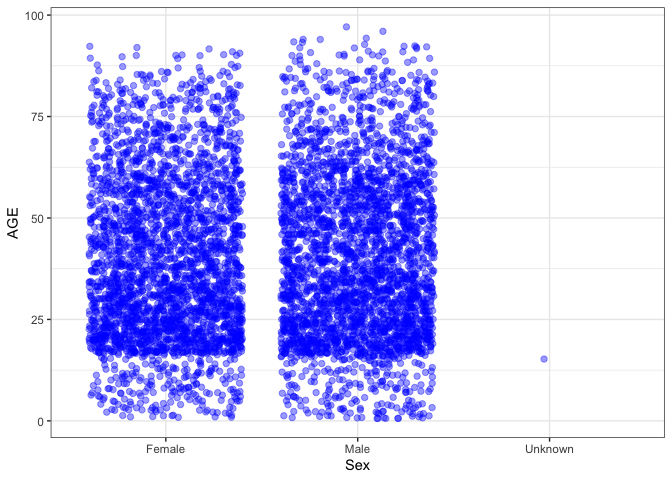

hw\_04
================
Neslihan Caliskan
3/8/2021

Read in the excel file from the internet 1. load in the package that
will allow you to download an excel file 2. enter the dir.create()
apackage for setting your working directory

``` r
library(readxl)
library(tidyverse)
```

    ## ── Attaching packages ─────────────────────────────────────── tidyverse 1.3.0 ──

    ## ✓ ggplot2 3.3.3     ✓ purrr   0.3.4
    ## ✓ tibble  3.0.6     ✓ dplyr   1.0.4
    ## ✓ tidyr   1.1.2     ✓ stringr 1.4.0
    ## ✓ readr   1.4.0     ✓ forcats 0.5.1

    ## ── Conflicts ────────────────────────────────────────── tidyverse_conflicts() ──
    ## x dplyr::filter() masks stats::filter()
    ## x dplyr::lag()    masks stats::lag()

``` r
library(readr)
library(ggplot2)

if ( !dir.exists( here::here("final_project", "data") ) ) {
  dir.create( here::here("final_project", "data"), recursive = TRUE )
}

url <- "https://data.sa.gov.au/data/dataset/21386a53-56a1-4edf-bd0b-61ed15f10acf/resource/0f522af2-ad29-47b4-82dc-12c9cbe79796/download/2019_data_sa_as_at_20200708.zip"


Data_fproj <- read_csv(here::here("data", "crashreason_2019.csv"),
                       col_types = cols(
  REPORT_ID = col_double(),
  UND_UNIT_NUMBER = col_double(),
  CASUALTY_NUMBER = col_double(),
  `Casualty Type` = col_character(),
  Sex = col_character(),
  AGE = col_double(),
  `Position In Veh` = col_character(),
  `Thrown Out` = col_character(),
  `Injury Extent` = col_character(),
  `Seat Belt` = col_character(),
  Helmet = col_character(),
  Hospital = col_character()
)

                       )
```

    ## Warning: 6121 parsing failures.
    ## row       col               expected           actual                                                                               file
    ##   1 REPORT_ID no trailing characters 2019-3-8/07/2020 '/Users/Nesli/Desktop/Github/hw-ncaliskan/final_project/data/crashreason_2019.csv'
    ##   2 REPORT_ID no trailing characters 2019-4-8/07/2020 '/Users/Nesli/Desktop/Github/hw-ncaliskan/final_project/data/crashreason_2019.csv'
    ##   3 REPORT_ID no trailing characters 2019-6-8/07/2020 '/Users/Nesli/Desktop/Github/hw-ncaliskan/final_project/data/crashreason_2019.csv'
    ##   4 REPORT_ID no trailing characters 2019-7-8/07/2020 '/Users/Nesli/Desktop/Github/hw-ncaliskan/final_project/data/crashreason_2019.csv'
    ##   5 REPORT_ID no trailing characters 2019-7-8/07/2020 '/Users/Nesli/Desktop/Github/hw-ncaliskan/final_project/data/crashreason_2019.csv'
    ## ... ......... ...................... ................ ..................................................................................
    ## See problems(...) for more details.

``` r
Data_fproj %>% 
  summarise(across(
    mean = ~mean(.x, na.rm = TRUE),
    sd = ~sd(.x, na.rm = TRUE)
              
                   ))
```

    ## # A tibble: 6,031 x 12
    ##    REPORT_ID UND_UNIT_NUMBER CASUALTY_NUMBER `Casualty Type` Sex     AGE
    ##        <dbl>           <dbl>           <dbl> <chr>           <chr> <dbl>
    ##  1        NA               2               1 Pedestrian      Male     41
    ##  2        NA               1               1 Rider           Male     21
    ##  3        NA               1               1 Driver          Fema…    26
    ##  4        NA               1               1 Passenger       Male      2
    ##  5        NA               1               2 Passenger       Male     NA
    ##  6        NA               2               1 Driver          Male     77
    ##  7        NA               1               1 Passenger       Fema…    31
    ##  8        NA               1               1 Rider           Fema…    56
    ##  9        NA               1               1 Rider           Male     46
    ## 10        NA               1               1 Driver          Male     18
    ## # … with 6,021 more rows, and 6 more variables: `Position In Veh` <chr>,
    ## #   `Thrown Out` <chr>, `Injury Extent` <chr>, `Seat Belt` <chr>, Helmet <chr>,
    ## #   Hospital <chr>

``` r
Data_fproj %>%
  ggplot()+
  aes(x = Sex,
      y = AGE) +
  geom_jitter(fill = "blue" , 
             color = "blue", 
             alpha = .4,
             size = 3,
             shape = 20) +
  theme_bw()
```

    ## Warning: Removed 90 rows containing missing values (geom_point).

<!-- -->
