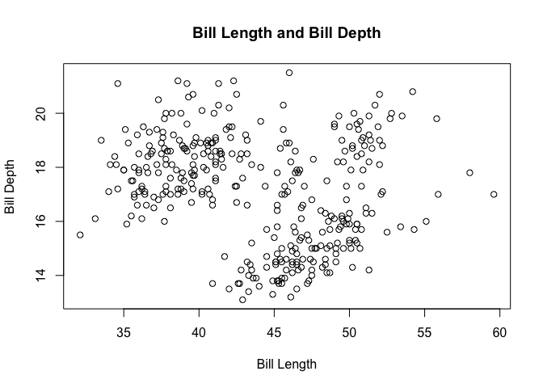

HW1: Exploring Penguins
================
Neslihan Caliskan
1/25/2021

## Descriptive Summary of the Dataset

``` r
library("palmerpenguins")

palmerpenguins::penguins
```

    ## # A tibble: 344 x 8
    ##    species island bill_length_mm bill_depth_mm flipper_length_… body_mass_g
    ##    <fct>   <fct>           <dbl>         <dbl>            <int>       <int>
    ##  1 Adelie  Torge…           39.1          18.7              181        3750
    ##  2 Adelie  Torge…           39.5          17.4              186        3800
    ##  3 Adelie  Torge…           40.3          18                195        3250
    ##  4 Adelie  Torge…           NA            NA                 NA          NA
    ##  5 Adelie  Torge…           36.7          19.3              193        3450
    ##  6 Adelie  Torge…           39.3          20.6              190        3650
    ##  7 Adelie  Torge…           38.9          17.8              181        3625
    ##  8 Adelie  Torge…           39.2          19.6              195        4675
    ##  9 Adelie  Torge…           34.1          18.1              193        3475
    ## 10 Adelie  Torge…           42            20.2              190        4250
    ## # … with 334 more rows, and 2 more variables: sex <fct>, year <int>

``` r
##Get a descriptive summary of the penguins dataset
summary(penguins)
```

    ##       species          island    bill_length_mm  bill_depth_mm  
    ##  Adelie   :152   Biscoe   :168   Min.   :32.10   Min.   :13.10  
    ##  Chinstrap: 68   Dream    :124   1st Qu.:39.23   1st Qu.:15.60  
    ##  Gentoo   :124   Torgersen: 52   Median :44.45   Median :17.30  
    ##                                  Mean   :43.92   Mean   :17.15  
    ##                                  3rd Qu.:48.50   3rd Qu.:18.70  
    ##                                  Max.   :59.60   Max.   :21.50  
    ##                                  NA's   :2       NA's   :2      
    ##  flipper_length_mm  body_mass_g       sex           year     
    ##  Min.   :172.0     Min.   :2700   female:165   Min.   :2007  
    ##  1st Qu.:190.0     1st Qu.:3550   male  :168   1st Qu.:2007  
    ##  Median :197.0     Median :4050   NA's  : 11   Median :2008  
    ##  Mean   :200.9     Mean   :4202                Mean   :2008  
    ##  3rd Qu.:213.0     3rd Qu.:4750                3rd Qu.:2009  
    ##  Max.   :231.0     Max.   :6300                Max.   :2009  
    ##  NA's   :2         NA's   :2

``` r
##Check how many columns does penguins dataset has?
head(penguins)
```

    ## # A tibble: 6 x 8
    ##   species island bill_length_mm bill_depth_mm flipper_length_… body_mass_g sex  
    ##   <fct>   <fct>           <dbl>         <dbl>            <int>       <int> <fct>
    ## 1 Adelie  Torge…           39.1          18.7              181        3750 male 
    ## 2 Adelie  Torge…           39.5          17.4              186        3800 fema…
    ## 3 Adelie  Torge…           40.3          18                195        3250 fema…
    ## 4 Adelie  Torge…           NA            NA                 NA          NA <NA> 
    ## 5 Adelie  Torge…           36.7          19.3              193        3450 fema…
    ## 6 Adelie  Torge…           39.3          20.6              190        3650 male 
    ## # … with 1 more variable: year <int>

``` r
##Check how many rows does the penguins dataset has?
nrow(penguins)
```

    ## [1] 344

``` r
Mean_Penguins <- mean(penguins, body_mass_g, na.rm = TRUE)
```

    ## Warning in mean.default(penguins, body_mass_g, na.rm = TRUE): argument is not
    ## numeric or logical: returning NA

## Plots

Plotting Bill Length and Bill Depth

<!-- -->

Note that the `echo = FALSE` parameter was added to the code chunk to
prevent printing of the R code that generated the plot.
