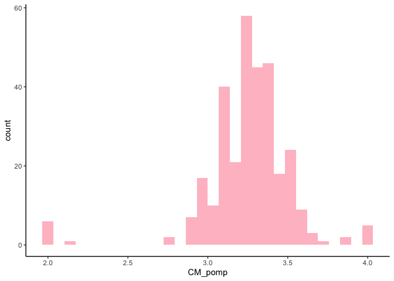
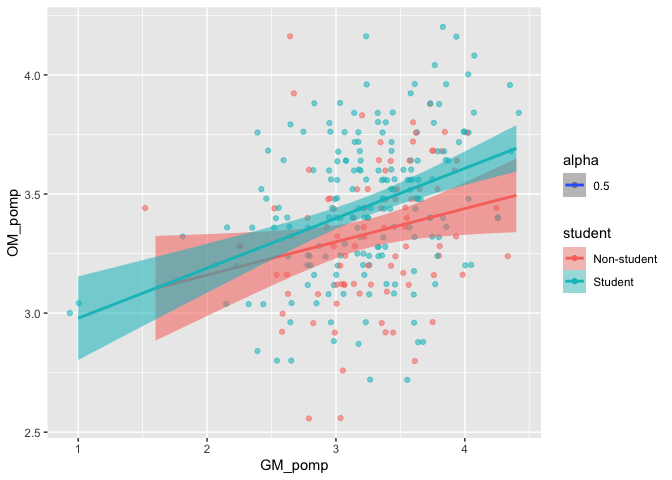
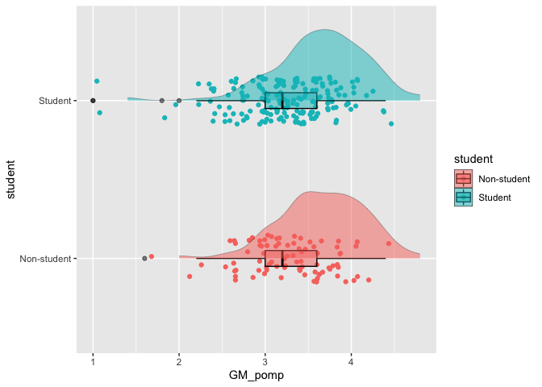

Homework 3
================
Neslihan Caliskan
2/24/2021

# Homework 03

You will analyze data looking at the relationship between **green
reputation** and three personality traits–**compassion**, **intellectual
curiosity**, and **openness to experiences**. The dataset includes data
from **students** and
    **non-students**.

``` r
library(tidyverse)
```

    ## ── Attaching packages ─────────────────────────────────────── tidyverse 1.3.0 ──

    ## ✓ ggplot2 3.3.3     ✓ purrr   0.3.4
    ## ✓ tibble  3.0.6     ✓ dplyr   1.0.4
    ## ✓ tidyr   1.1.2     ✓ stringr 1.4.0
    ## ✓ readr   1.4.0     ✓ forcats 0.5.1

    ## ── Conflicts ────────────────────────────────────────── tidyverse_conflicts() ──
    ## x dplyr::filter() masks stats::filter()
    ## x dplyr::lag()    masks stats::lag()

``` r
library(ggplot2)
library(ggdist)
```

``` r
dictionary <- readr::read_csv(("green_dictionary.csv"))
```

    ## 
    ## ── Column specification ────────────────────────────────────────────────────────
    ## cols(
    ##   Item = col_character(),
    ##   Content = col_character(),
    ##   Options = col_character(),
    ##   Keying = col_double()
    ## )

``` r
green_data <- readr::read_csv(("green_data.csv"))
```

    ## 
    ## ── Column specification ────────────────────────────────────────────────────────
    ## cols(
    ##   .default = col_double(),
    ##   id = col_character()
    ## )
    ## ℹ Use `spec()` for the full column specifications.

For your assignment, do the following.

1.  Inspect the item responses (e.g., with graphs or by summarizing
    distinct values). Is anything unusual?

Get the summaries of each data file

``` r
dictionary %>%
  summarize(dictionary)
```

    ## # A tibble: 36 x 4
    ##    Item   Content                                         Options         Keying
    ##    <chr>  <chr>                                           <chr>            <dbl>
    ##  1 green1 Overall, I am regarded as an environmentally c… 1-5; SD, D, NA…      1
    ##  2 green2 I am not particularly known for protecting the… 1-5; SD, D, NA…     -1
    ##  3 green3 My friends know I enjoy nature.                 1-5; SD, D, NA…      1
    ##  4 green4 I have a reputation for living in harmony with… 1-5; SD, D, NA…      1
    ##  5 green5 Among people I know, I seem to be the one most… 1-5; SD, D, NA…      1
    ##  6 comp1  I feel others' emotions.                        1-5; SD, D, NA…      1
    ##  7 comp2  I inquire about others' well-being.             1-5; SD, D, NA…      1
    ##  8 comp3  I sympathize with others' feelings.             1-5; SD, D, NA…      1
    ##  9 comp4  I take an interest in other people's lives.     1-5; SD, D, NA…      1
    ## 10 comp5  I like to do things for others.                 1-5; SD, D, NA…      1
    ## # … with 26 more rows

``` r
#getting rid of the -99 values

green_data_new <- green_data %>%
                na_if("-99")


reversed <- dictionary %>%
  filter(Keying == -1) %>%
  pull(Item)

green_datar <- green_data_new %>% 
  mutate(across(all_of(reversed),
                ~ recode(.x, "1"= 5,"2" = 4,"4" = 2,"5"= 1 ),
                .names = "{.col}r"))

green_data_new$student <- recode_factor(green_data_new$student, '1' = "Non-student", '2' = "Student", .default = NULL)


#There are -99 s in the data file that needs to be recoded
```

2.  Compute total scores for the four scales. Recode variables as
    needed.

<!-- end list -->

``` r
green_datar %>% 
  rowwise() %>% 
  mutate(green_tot = sum(c_across(green1:green5), na.rm = TRUE),
         comp_tot = sum(c_across(comp1:comp10r), na.rm = TRUE),
         intel_tot = sum(c_across(intel1:intel10r), na.rm = TRUE),
         open_tot = sum(c_across(open1:open10r), na.rm = TRUE))
```

    ## # A tibble: 373 x 55
    ## # Rowwise: 
    ##    id    green1 green2 green3 green4 green5 comp1 comp2 comp3 comp4 comp5 comp6
    ##    <chr>  <dbl>  <dbl>  <dbl>  <dbl>  <dbl> <dbl> <dbl> <dbl> <dbl> <dbl> <dbl>
    ##  1 9099       4      2      5      4      3     2     5     4     4     2     2
    ##  2 6275       3      5      3      3      1     4     5     4     5     5     1
    ##  3 8116       4      2      5      4      3     4     5     5     4     5     1
    ##  4 8586       4      3      5      4      3     4     5     5     4     5     1
    ##  5 0406       3      2      4      4      4     4     4     4     4     4     2
    ##  6 5645       4      3      4      4      3     5     5     5     4     4     2
    ##  7 3788       1      1      1      1      1     3     3     3     3     3     3
    ##  8 8424       4      3      2      2      2     1     1     1     2     2     4
    ##  9 8450       4      2      3      5      2     4     4     4     4     4     1
    ## 10 0512       4      2      5      5      4     5     2     5     4     2     2
    ## # … with 363 more rows, and 43 more variables: comp7 <dbl>, comp8 <dbl>,
    ## #   comp9 <dbl>, comp10 <dbl>, intel1 <dbl>, intel2 <dbl>, intel3 <dbl>,
    ## #   intel4 <dbl>, intel5 <dbl>, intel6 <dbl>, intel7 <dbl>, intel8 <dbl>,
    ## #   intel9 <dbl>, intel10 <dbl>, open1 <dbl>, open2 <dbl>, open3 <dbl>,
    ## #   open4 <dbl>, open5 <dbl>, open6 <dbl>, open7 <dbl>, open8 <dbl>,
    ## #   open9 <dbl>, open10 <dbl>, student <dbl>, green2r <dbl>, comp6r <dbl>,
    ## #   comp7r <dbl>, comp8r <dbl>, comp9r <dbl>, comp10r <dbl>, intel7r <dbl>,
    ## #   intel8r <dbl>, intel9r <dbl>, intel10r <dbl>, open7r <dbl>, open8r <dbl>,
    ## #   open9r <dbl>, open10r <dbl>, green_tot <dbl>, comp_tot <dbl>,
    ## #   intel_tot <dbl>, open_tot <dbl>

3.  Rescale the variables so that they go from 0-100 instead of the
    original range. Name the recaled variables `*_pomp`.

<!-- end list -->

``` r
green_data_pomp <- green_datar %>% 
  mutate(across(c(green1:open10),
         ~ recode(.x, "1"= 0,"2" = 25, "3" = 50, "4" = 75,"5"= 100),
                .names = "{.col}_pomp"))

print(green_data_pomp)
```

    ## # A tibble: 373 x 86
    ##    id    green1 green2 green3 green4 green5 comp1 comp2 comp3 comp4 comp5 comp6
    ##    <chr>  <dbl>  <dbl>  <dbl>  <dbl>  <dbl> <dbl> <dbl> <dbl> <dbl> <dbl> <dbl>
    ##  1 9099       4      2      5      4      3     2     5     4     4     2     2
    ##  2 6275       3      5      3      3      1     4     5     4     5     5     1
    ##  3 8116       4      2      5      4      3     4     5     5     4     5     1
    ##  4 8586       4      3      5      4      3     4     5     5     4     5     1
    ##  5 0406       3      2      4      4      4     4     4     4     4     4     2
    ##  6 5645       4      3      4      4      3     5     5     5     4     4     2
    ##  7 3788       1      1      1      1      1     3     3     3     3     3     3
    ##  8 8424       4      3      2      2      2     1     1     1     2     2     4
    ##  9 8450       4      2      3      5      2     4     4     4     4     4     1
    ## 10 0512       4      2      5      5      4     5     2     5     4     2     2
    ## # … with 363 more rows, and 74 more variables: comp7 <dbl>, comp8 <dbl>,
    ## #   comp9 <dbl>, comp10 <dbl>, intel1 <dbl>, intel2 <dbl>, intel3 <dbl>,
    ## #   intel4 <dbl>, intel5 <dbl>, intel6 <dbl>, intel7 <dbl>, intel8 <dbl>,
    ## #   intel9 <dbl>, intel10 <dbl>, open1 <dbl>, open2 <dbl>, open3 <dbl>,
    ## #   open4 <dbl>, open5 <dbl>, open6 <dbl>, open7 <dbl>, open8 <dbl>,
    ## #   open9 <dbl>, open10 <dbl>, student <dbl>, green2r <dbl>, comp6r <dbl>,
    ## #   comp7r <dbl>, comp8r <dbl>, comp9r <dbl>, comp10r <dbl>, intel7r <dbl>,
    ## #   intel8r <dbl>, intel9r <dbl>, intel10r <dbl>, open7r <dbl>, open8r <dbl>,
    ## #   open9r <dbl>, open10r <dbl>, green1_pomp <dbl>, green2_pomp <dbl>,
    ## #   green3_pomp <dbl>, green4_pomp <dbl>, green5_pomp <dbl>, comp1_pomp <dbl>,
    ## #   comp2_pomp <dbl>, comp3_pomp <dbl>, comp4_pomp <dbl>, comp5_pomp <dbl>,
    ## #   comp6_pomp <dbl>, comp7_pomp <dbl>, comp8_pomp <dbl>, comp9_pomp <dbl>,
    ## #   comp10_pomp <dbl>, intel1_pomp <dbl>, intel2_pomp <dbl>, intel3_pomp <dbl>,
    ## #   intel4_pomp <dbl>, intel5_pomp <dbl>, intel6_pomp <dbl>, intel7_pomp <dbl>,
    ## #   intel8_pomp <dbl>, intel9_pomp <dbl>, intel10_pomp <dbl>, open1_pomp <dbl>,
    ## #   open2_pomp <dbl>, open3_pomp <dbl>, open4_pomp <dbl>, open5_pomp <dbl>,
    ## #   open6_pomp <dbl>, open7_pomp <dbl>, open8_pomp <dbl>, open9_pomp <dbl>,
    ## #   open10_pomp <dbl>

``` r
Av_green_data_pomp <- green_data_pomp %>% 
  rowwise() %>% 
  mutate(GM_pomp = mean(c_across(green1:green5), na.rm = TRUE),
         CM_pomp = mean(c_across(comp1:comp10r), na.rm = TRUE),
         IM_pomp = mean(c_across(intel1:intel10r), na.rm = TRUE),
         OM_pomp = mean(c_across(open1:open10r), na.rm = TRUE))
```

4.  Make plots that illustrate the distributions of the 4 POMP-scored
    variables.

<!-- end list -->

``` r
Av_green_data_pomp %>% 
ggplot() +
  aes(CM_pomp,GM_pomp) +
  geom_smooth(method = lm) 
```

    ## `geom_smooth()` using formula 'y ~ x'

    ## Warning: Removed 58 rows containing non-finite values (stat_smooth).

<!-- -->

``` r
Av_green_data_pomp %>% 
ggplot() +
aes(x = GM_pomp) +
  geom_histogram(fill = "orange") +
  theme_classic()
```

    ## `stat_bin()` using `bins = 30`. Pick better value with `binwidth`.

    ## Warning: Removed 58 rows containing non-finite values (stat_bin).

<!-- -->

``` r
Av_green_data_pomp %>% 
ggplot() +
aes(x = CM_pomp) +
  geom_histogram(fill = "pink") +
  theme_classic()
```

    ## `stat_bin()` using `bins = 30`. Pick better value with `binwidth`.

    ## Warning: Removed 58 rows containing non-finite values (stat_bin).

<!-- -->

``` r
Av_green_data_pomp %>% 
ggplot() +
aes(x = IM_pomp) +
  geom_histogram(bins = 50, fill = "purple") +
  theme_classic()
```

    ## Warning: Removed 58 rows containing non-finite values (stat_bin).

<!-- -->

``` r
Av_green_data_pomp %>% 
ggplot() +
aes(x = OM_pomp) +
  geom_histogram(bins = 50, fill = "yellow") +
  theme_classic()
```

    ## Warning: Removed 58 rows containing non-finite values (stat_bin).

<!-- -->

5.  Make scatterplots showing the relationships between **green
    reputation** and each personality trait. Include trend lines for
    **students** and **non-students**. What do these plots show?

<!-- end list -->

``` r
Av_green_data_pomp %>% 
  filter(!is.na(student)) %>% 
  ggplot() +
  aes(y = CM_pomp,
      x = GM_pomp,
      group = student,
      color = student,
      fill = student,
      alpha = 0.5) +
  geom_jitter() +
  geom_smooth(method = "lm")
```

    ## `geom_smooth()` using formula 'y ~ x'

<!-- -->

``` r
Av_green_data_pomp %>% 
  filter(!is.na(student)) %>% 
  ggplot() +
  aes(y = IM_pomp,
      x = GM_pomp,
      group = student,
      color = student,
      fill = student, 
      alpha = 0.5) +
  geom_jitter() +
  geom_smooth(method = "lm")
```

    ## `geom_smooth()` using formula 'y ~ x'

<!-- -->

``` r
Av_green_data_pomp %>% 
  filter(!is.na(student)) %>% 
  ggplot() +
  aes(y = OM_pomp,
      x = GM_pomp,
      group = student,
      color = student,
      fill = student, 
      alpha = 0.5) +
  geom_jitter() +
  geom_smooth(method = "lm")
```

    ## `geom_smooth()` using formula 'y ~ x'

<!-- -->

``` r
#For all comparisons, the students had slightly higher scores but the difference was not large. 
```

6.  Compare **green reputation** for students and non-students using a
    **rainfall plot** (bar + density + data points).

<!-- end list -->

``` r
ggplot(na.omit(Av_green_data_pomp)) +
  aes(x = GM_pomp,
      y = student,
      fill = student,
      color = student) +
  geom_jitter(height = .15) +
  geom_boxplot(color = "black",
               alpha = .5,
               width = .1,
               size =.5) +
  ggdist::stat_slab(height = 3,
                    color = "black",
                    size = .2,
                    alpha = .5,
                    position = position_nudge((y=.2)))
```

    ## Warning: Continuous x aesthetic -- did you forget aes(group=...)?

    ## Warning: Computation failed in `stat_slab()`:
    ## need at least two non-NA values to interpolate

<!-- -->

``` r
#I couldn't run this code properly, could you help me figure out why?
```

7.  Compute a summary table of means, SDs, medians, minima, and maxima
    for the four total scores for students and non-students.

In your assignment, prepare an RMarkdown file that includes both the
coding and (for 4-7) narrative descriptions of your results.

``` r
summary_GD <- Av_green_data_pomp %>% 
  na.omit() %>% 
  group_by(student) %>% 
  summarize(across(c(GM_pomp, IM_pomp, CM_pomp, OM_pomp),
            list(
              Av = ~ mean(.x, na.rm = T),
              SD = ~ sd(.x, na.rm = T),
              Med = ~ median(.x, na.rm = T),
              Min = ~ min(.x, na.rm = T),
              Max = ~ max(.x, na.rm = T)
            )))

#Even though I ran the code to recode student names at the end it still showed them as 1 & 2. 
#Students had higher average of oveal Openness scores. On average, non-students have higher environmental consciousness. 
```
