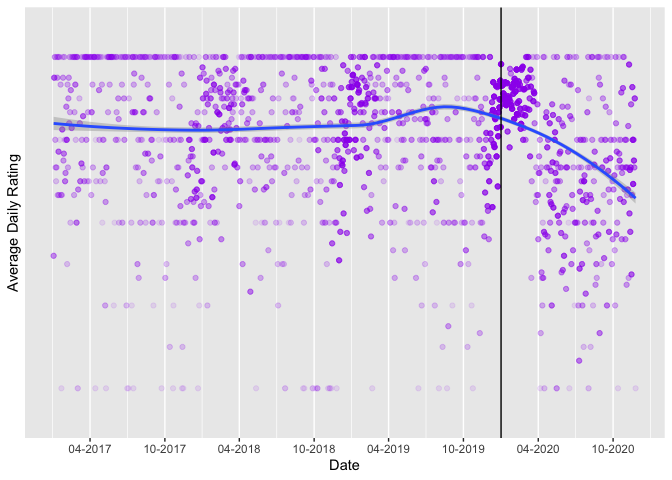
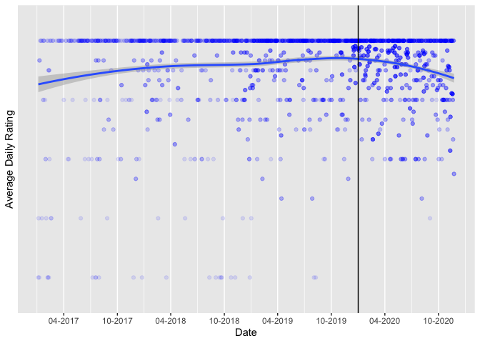
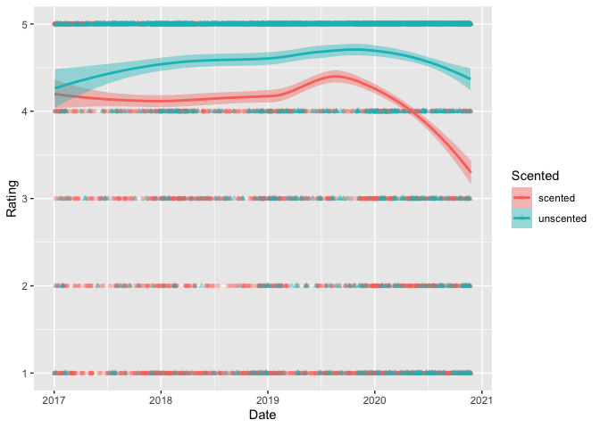
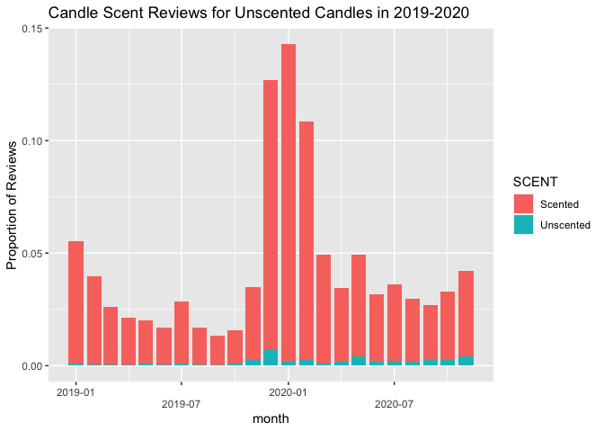

Consequences of Covid-19 for Candle Critiques
================
Nesli Caliskan
3/22/2021

For this assignment, you will produce a report exploring the impact of
Covid-19 on scented candle ratings.

Write this assignment like a report. You should describe the dataset,
show appropriate plots, and interpret them. Remove the instruction text
from this document.

In your report, fold the code blocks, enable code highlighting, and set
an HTML theme of your choice. Set other document options as you prefer
and as appropriate.

## The data

You will work with two datasets `Scented_all.xlsx` and
`Unscented_all.xlsx`. Each dataset contains the following information
for the Top 3 selling scented or unscented candles sold on Amazon:

1.  `CandleID`: A numeric id variable for candle 1-3 in each category.
2.  `Date`: The date of the review.
3.  `Rating`: The 1-5 rating for the review.
4.  `Review`: For the scented candles, the text of the review.

Read in the sheets

``` r
scented_data <- readxl::read_xlsx("Scented_all.xlsx")

unscented_data <- readxl::read_xlsx("Unscented_all.xlsx")
```

## Part 1: Average daily ratings for scented and unscented candles

For each category of candle (scented versus unscented), for all days
from **2017-01-01** onward, create a plot showing:

1.  Date on the x axis 1. Hint: use `scale_x_date()` 2. Format the date
    labels as `"%m-%Y"` 3. Set the date breaks to be “6 months”
2.  **Average daily rating** of each candle on the y axis
3.  A smooth trend line (not linear; `method = "loess"`)
4.  A dashed vertical line at January 01, 2020 1. Hint: use
    `geom_vline()` and set `xintercept =
    as.numeric(as.Date("2020-01-20"))`

Be sure to make the plots beautiful.

1.  Address overplotting of points using transparency or shapes.
2.  Use an appealing theme and color scheme.
3.  Set appropriately formatted axis titles and main plot title.
4.  Place the two plots side by side.

Note: The raw data are **individual reviews** so you will need to
compute summary results to get average daily ratings for the desired
date range.

Interpret these graphs. What do they show about scented candles over the
time period?

``` r
scented_data_av <- scented_data %>% 
  filter(Date > "2017-01-01") %>% 
  group_by(Date) %>% 
  mutate(MN = mean(Rating))


ggplot(scented_data_av, aes(as.Date(Date), MN)) +
  geom_point(alpha = 0.1,
             color = "purple",
             fill = "purple") +
  scale_x_date("Date", date_labels = "%m-%Y", date_breaks = "6 months") +
  scale_y_discrete(name = "Average Daily Rating") +
  geom_smooth(method = "loess") +
  geom_vline(xintercept = as.numeric(as.Date("2020-01-01")))
```

    ## `geom_smooth()` using formula 'y ~ x'

<!-- -->

``` r
unscented_data_av <- unscented_data %>% 
  filter(Date > "2017-01-01") %>% 
  group_by(Date) %>% 
  mutate(MN = mean(Rating))

ggplot(unscented_data_av, aes(as.Date(Date), MN)) +
  geom_point(alpha = 0.1,
             color = "blue",
             fill = "blue") +
  scale_x_date("Date", date_labels = "%m-%Y", date_breaks = "6 months") +
  scale_y_discrete(name = "Average Daily Rating") +
  geom_smooth(method = "loess") +
  geom_vline(xintercept = as.numeric(as.Date("2020-01-01")))
```

    ## `geom_smooth()` using formula 'y ~ x'

<!-- -->

## Part 2: Combined plot

Combine the two datasets into one and make a plot similar to above, but
showing both unscented and scented candles. Distinguish scented versus
unscented candles using color, shape, and line type (for the trend
lines).

``` r
candles_full <- bind_rows(
    scented = scented_data, 
    unscented = unscented_data, 
    .id = "Scented"
)


candles_fulls <- candles_full %>%
filter(Date > "2017-01-01") %>%
group_by(Date) %>%
mutate(
MN = mean(Rating)
)
```

``` r
candles_fulls %>%
ggplot() +
aes(x = Date, y = Rating, color = Scented, fill = Scented, shape = Scented) +
geom_point(alpha = 0.4) +
geom_smooth(method = "loess")
```

    ## `geom_smooth()` using formula 'y ~ x'

<!-- -->

Which of these two sets of plots do you find easier to interpret?

## Part 3: Proportion of reviews mentioning “no scent”

Use the scented candles database and make one more plot showing:

1.  For **each month in 2019 and 2020**,
2.  On the x axis, month and year
3.  On the y axis, the **proportion of reviews** mentioning that the
    scented candles have no smell - Include both the mean (proportion)
    and a 95% confidence interval
4.  Color the symbols by year (2019 vs 2020)

As before, make the

Hints:

1.  To round each date to its months, use: - `mutate(month =
    lubridate::floor_date(Date, "month"))`
2.  To compute a mean and confidence interval for a variable on a plot,
    similar to a box plot, use: - `stat_summary(aes(y = noscent),
    fun.data = mean_cl_normal)`
3.  Use the function below to detect “no smell”-related text in the
    `Review` column.

<!-- end list -->

``` r
Unscented_Review <- scented_data %>%
  filter(Date > "2019-01-01") %>%
  mutate(month = lubridate::floor_date(Date, "month")) %>%
  mutate(Review = str_no_scent(Review)) %>% 
  group_by(ScentReview2, month)
```

``` r
Unscented_Review %>%
  ggplot() +
  aes(x = month ,
        y = (..count..)/sum(..count..), 
        fill = ScentReview2, 
        color = month
        ) +
  geom_bar() +
  labs(title = "Candle Scent Reviews for Unscented Candles in 2019-2020") +
  scale_y_continuous("Proportion of Reviews") +
  guides(x = guide_axis(n.dodge = 2), color = guide_legend(title = "SCENT"), fill = guide_legend(title = "SCENT")) 
```

<!-- -->

What pattern do you see? Is there a trend over time regarding
smell-related reviews? How does 2020 compare to 2019?

There is a dramatic decrease in the reviews for the scent of candles
which may be related to the fact that Covid-19 causes loss of smell in
patients.
